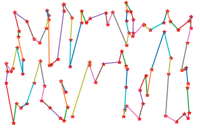

# TSP_GA算法加速
对TSP问题的遗传算法进行了cuda加速，对遗传算法的交叉、变异、生成子代的操作都有明显的性能提升。在交叉操作中需要不断地在亲代染色体中搜索子代的基因对应的位置，在交叉的核函数中定义了查找表优化了查找的效率。生成子代时采用了thrust基数排序对适应度进行排序并选出适应度高的个体生成新的种群。对于节点数、个体数、迭代次数分别为100、100、10000的TSP遗传算法，cpu耗时大约为60s，cuda加速后耗时为3.25s

# CUDA计算结果
最后生成的最短路如图：
